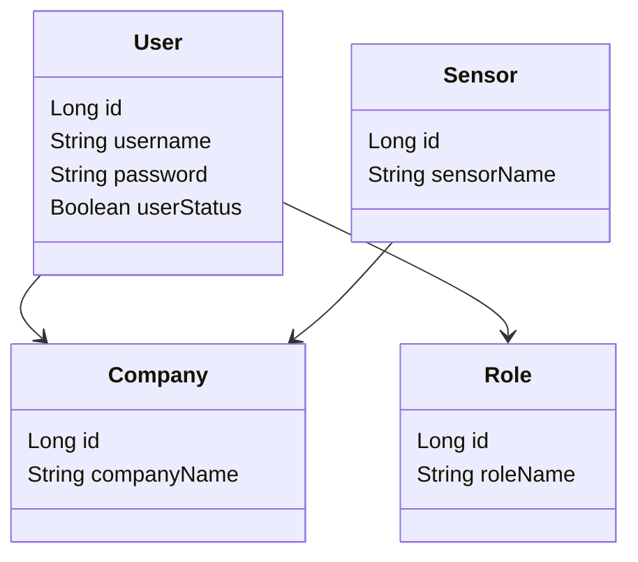
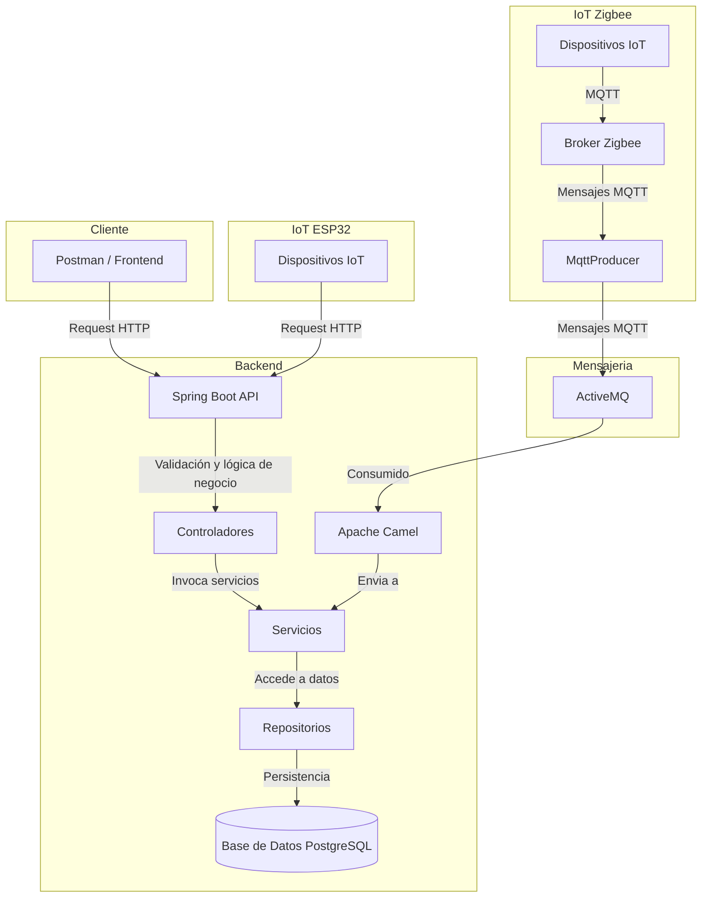

# IoT API - Sensor Manager

Este proyecto es una API RESTful desarrollada en **Spring Boot** para administrar sensores, usuarios, roles y sus datos asociados en el contexto de Internet de las Cosas (IoT). Además, incluye integración con **Apache Camel + ActiveMQ** y un panel de documentación Swagger.

## 🚀 Tecnologías

- Java 17
- Spring Boot 3
- Spring Data JPA
- Spring Security
- MQTT (Eclipse Paho)
- PostgreSQL
- Maven

## 📁 Estructura del proyecto

```plaintext
src/main/java/com/sensormanager/iot/
├── adapter/                # Adaptadores para transformar entidades a DTOs
├── camel/                  # Rutas de integración con Apache Camel
├── config/                 # Configuraciones generales (Swagger, Seguridad)
├── controller/             # Controladores REST
├── dto/                    # Objetos de transferencia de datos
├── model/                  # Entidades JPA
├── repository/             # Repositorios JPA
├── security/               # Configuración y lógica de seguridad
├── service/                # Lógica de negocio (interfaces + implementación)
```

---

## ⚙️ Dependencias principales (`pom.xml`)

- `spring-boot-starter-data-jpa`: Persistencia con JPA/Hibernate.
- `spring-boot-starter-web`: API REST.
- `spring-boot-starter-security`: Seguridad basada en roles.
- `springdoc-openapi-ui`: Generación automática de Swagger UI.
- `camel-spring-boot-starter`: Apache Camel para integración.
- `camel-activemq-starter`: Conexión con ActiveMQ.
- `org.eclipse.paho.client.mqttv3`: Cliente MQTT para IoT.

---

## 🛠 Configuración (`application.properties`)

```properties
spring.datasource.url=jdbc:postgresql://localhost:5432/iot_db
spring.datasource.username=postgres
spring.datasource.password=postgres
spring.jpa.hibernate.ddl-auto=update
springdoc.swagger-ui.path=/swagger-ui.html
```

Incluye también:
- Configuración para ActiveMQ.
- Documentación automática vía Swagger.

---

## 🔌 Endpoints principales

Los endpoints siguen la estructura REST:

- `GET /api/v1/sensordata`
- `POST /api/v1/sensordata`
- `PUT /api/v1/sensordata/{id}`
- `DELETE /api/v1/sensordata/{id}`

Consulta Swagger para más detalles (ver abajo).

---

## 🔐 Seguridad

- Usa **Basic Auth** con roles (`ROOT`, `COMPANY_ADMIN`, `SWAGGER_USER`, etc.).
- Swagger está protegido y requiere el rol `SWAGGER_USER`.
- Las rutas `/users`, `/companies`, etc. están protegidas por rol.

---

## 📘 Diagrama de clases (simplificado)


---
## 🧭 Arquitectura del Sistema: Comunicación entre Cliente, Backend e IoT


## ▶️ Cómo ejecutar

```bash
mvn clean install
mvn spring-boot:run
```

## ⚙️ Configuración de Base de Datos

Edita `src/main/resources/application.properties` para definir tus credenciales y host:

```properties
spring.datasource.url=jdbc:postgresql://localhost:5432/iot_db
spring.datasource.username=postgres
spring.datasource.password=tu_password
```

## 📘 API Documentation - Swagger UI

Nuestra API RESTful está documentada con [Swagger UI](https://swagger.io/tools/swagger-ui/), permitiendo explorar, probar y validar los endpoints desde una interfaz web amigable.

### 🚀 Acceso a Swagger

Una vez que el proyecto esté corriendo, puedes acceder directamente sin autenticación:

```
http://localhost:8080/swagger-ui.html
```

No se requieren credenciales para acceder a la documentación de Swagger. Puedes utilizar los endpoints públicos libremente desde la interfaz.

---

### 📦 Habilitar/Deshabilitar Swagger

La documentación Swagger se puede habilitar/deshabilitar modificando las siguientes propiedades en `application.properties`:

```properties
springdoc.api-docs.enabled=true
springdoc.swagger-ui.enabled=true
```
